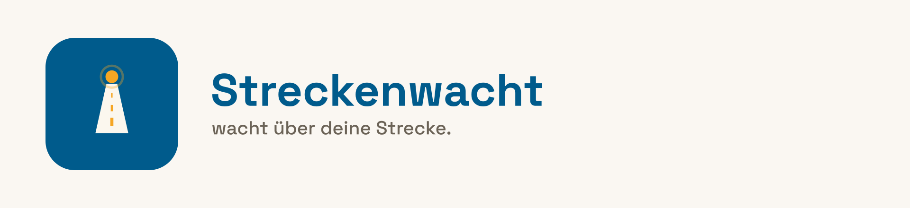

<picture>
  <source media="(prefers-color-scheme: dark)" srcset="assets/github/readme-header-dark@2x.png">
  
</picture>

> ⚠️ **In Entwicklung.** Noch kein nutzbares Release. Dieser README-Entwurf beschreibt den geplanten Funktionsumfang.

Streckenwacht wacht über deine Strecke – ob Autobahn, Bundesstraße oder dein täglicher Arbeitsweg. Baustellen, Sperrungen, Staus und Unfälle, direkt in deinem Home Assistant.

Verfolge Ereignisse auf frei wählbaren Straßen oder in einer selbst definierten Umgebung – z. B. deiner Pendelstrecke – als Kalender, Sensoren und Events für Automationen.

*In English:* Streckenwacht is a Home Assistant integration that watches your routes in Germany. It shows roadworks, closures, traffic jams and accidents for areas you define, using open data from Autobahn GmbH (nationwide motorways), MobiData BW (Baden-Württemberg) and the City of Stuttgart.

## Datenquellen

| Quelle | Abdeckung | Lizenz |
|---|---|---|
| [Autobahn GmbH – Autobahn-API](https://verkehr.autobahn.de/o/autobahn) | Bundesautobahnen, bundesweit: Baustellen, Sperrungen, Warnungen inkl. Staus/Unfälle | Daten der Autobahn GmbH des Bundes |
| [MobiData BW](https://mobidata-bw.de/dataset/baustelleninformationen-baden-wurttemberg) | Bundes-, Landes- und Kreisstraßen in Baden-Württemberg | Datenlizenz Deutschland – Namensnennung 2.0 |
| [Stadt Stuttgart – Baustellenkalender](https://www.stuttgart.de/baustellenkalender) | Vorbehaltsstraßennetz (Hauptachsen, Hauptradrouten) in Stuttgart | CC BY 4.0, © Landeshauptstadt Stuttgart |

## Was Streckenwacht nicht kann

Diese Quellen sind nicht vollständig:

- Die Autobahn-API deckt nur Bundesautobahnen ab, nicht Landes-, Kreis- oder Kommunalstraßen.
- MobiData BW deckt Bundes-, Landes- und Kreisstraßen in Baden-Württemberg ab, kommunale Straßen nur vereinzelt.
- Der Stuttgarter Baustellenkalender deckt nur das „Vorbehaltsstraßennetz" ab – Wohnstraßen, Notreparaturen und nicht verkehrsrelevante Arbeiten von Versorgern fehlen bewusst.
- Keine der Quellen garantiert Vollständigkeit oder eine feste Aktualisierungsfrequenz; alle Angaben stammen ungefiltert von den jeweiligen Behörden und Betreibern.

Kurz: Streckenwacht eignet sich gut, um größere Störungen auf Hauptstrecken im Blick zu behalten – nicht, um jede kleine Baustelle in jeder Nebenstraße zu erfassen.

## Installation (HACS, benutzerdefiniertes Repository)

Voraussetzung: Home Assistant **2026.3** oder neuer und [HACS](https://hacs.xyz/).

1. HACS öffnen → Menü (⋮) → **Benutzerdefinierte Repositories**.
2. URL `https://github.com/streckenwacht/integration` eintragen, Kategorie **Integration**, hinzufügen.
3. **Streckenwacht** in HACS herunterladen und Home Assistant neu starten.
4. **Einstellungen → Geräte & Dienste → Integration hinzufügen → Streckenwacht**.

## Einrichtung

*(folgt mit dem ersten Release)* – Datenquellen wählen, dann Beobachtungsbereiche anlegen (Zone + Radius oder konkrete Straße/Autobahn mit optionaler Fahrtrichtung).

## Entitäten pro Beobachtungsbereich

*(geplant, Namen können sich noch ändern)*

| Entität | Zweck |
|---|---|
| `calendar.streckenwacht_<bereich>` | Alle Ereignisse im Bereich als Kalendereinträge |
| `binary_sensor.streckenwacht_<bereich>_stoerung_aktiv` | An, sobald mindestens ein Ereignis aktiv ist |
| `sensor.streckenwacht_<bereich>_anzahl_ereignisse` | Anzahl aktueller Ereignisse, Details als Attribute |
| `event.streckenwacht_<bereich>_neues_ereignis` | Feuert bei neuen und beendeten Ereignissen |

## Was du damit bauen kannst

- **Push-Nachricht bei Reisezeitverlust** über einem Schwellwert (z. B. 15 Minuten) auf deiner Pendelstrecke.
- **Sprachansage beim Verlassen des Hauses**, falls seit gestern eine neue Sperrung auf deinem Weg aufgetaucht ist.
- **Kalender-Karte im Dashboard** mit allen kommenden Baustellen auf deiner Strecke.

## Lizenz

Code: [MIT](LICENSE). Die angezeigten Daten unterliegen den Lizenzen der jeweiligen Quellen (siehe Tabelle oben).
